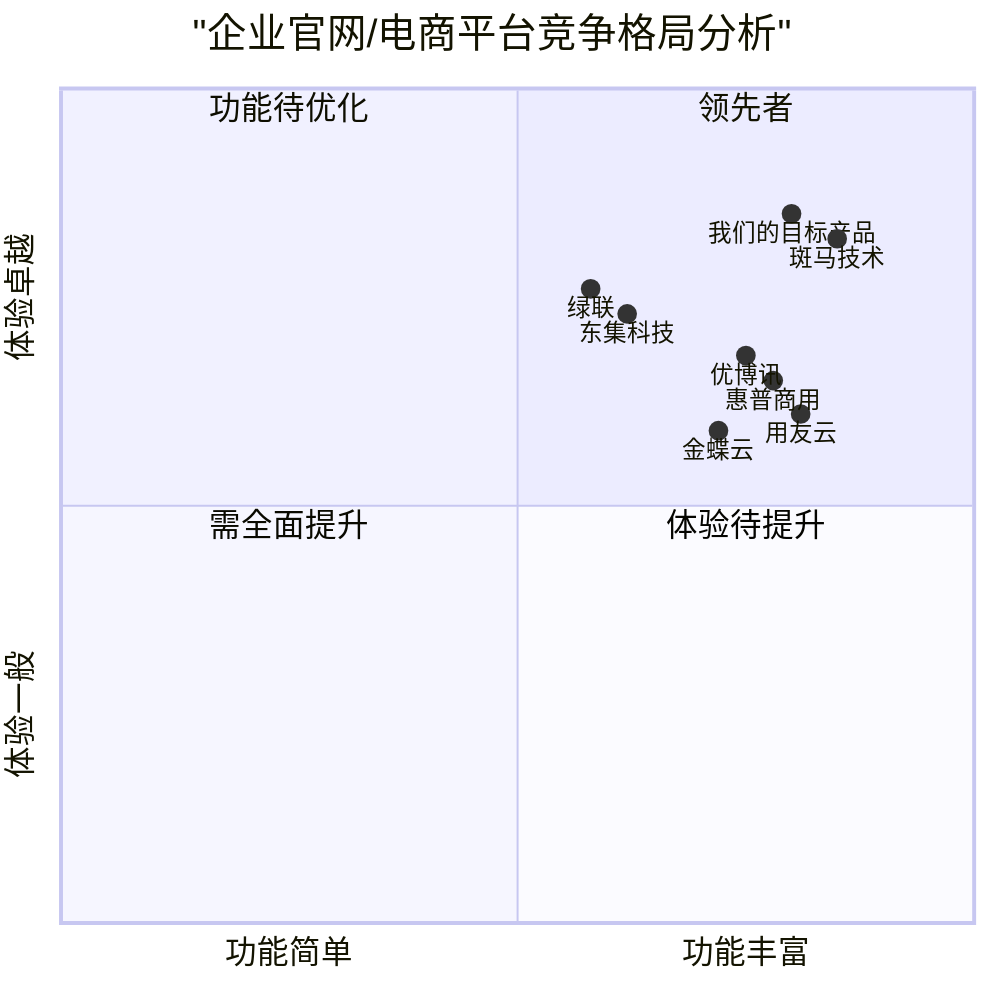
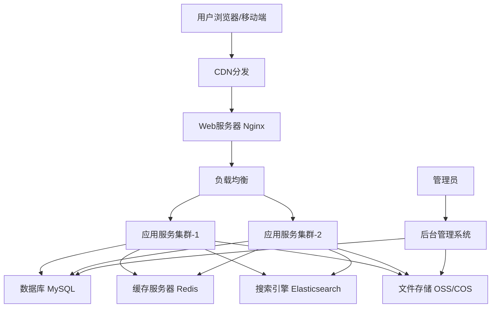

# 企业官网/电商平台产品需求文档 (PRD)

## 项目信息
- 项目名称：enterprise_website_ecommerce
- 编写日期：2025-02-27

## 原始需求概述

建设一个专业的企业官网/电商平台，用于展示及推广扫描设备、打印机设备、软件服务器和集成打包方案。该平台既能在线展示各品类产品的详细描述（图片、视频、参数等），也能通过资讯、文章和案例内容互相引导到产品详情页面，提高用户粘性和转化率。

## 1. 产品定义

### 1.1 产品目标

1. **提升品牌曝光与产品展示效果**：通过专业、直观的界面设计和多媒体展示方式，全面展现企业产品线和解决方案，增强品牌形象。

2. **优化用户获取信息体验**：建立清晰的产品分类体系和内容互联机制，帮助目标用户快速找到所需产品和技术信息，提升信息获取效率。

3. **促进销售转化与客户沟通**：提供在线咨询、留言和互动功能，缩短潜在客户从了解到咨询的路径，提高商业转化率。

### 1.2 用户故事

1. **作为企业采购负责人**，我希望能够在平台上通过参数对比筛选出符合我们需求的扫描设备，以便做出最优的采购决策。

2. **作为渠道代理商**，我希望能够查看完整的产品线和最新解决方案，以便向我的客户提供更全面的产品推荐。

3. **作为技术人员**，我希望能够查看设备的详细技术参数和使用说明文档，以便评估产品是否符合我们的系统集成需求。

4. **作为潜在客户**，我希望能够浏览相关的行业案例和技术文章，以便了解产品在实际应用场景中的表现。

5. **作为回访用户**，我希望能够快速联系客服咨询产品的最新价格和库存情况，以便进行后续采购。

### 1.3 竞品分析

| 竞争产品 | 优势 | 劣势 |
| --- | --- | --- |
| 优博讯官网 | 1. 产品分类清晰<br>2. 技术参数展示全面<br>3. 行业解决方案丰富 | 1. 内容更新频率低<br>2. 产品与文章关联不足<br>3. 移动端体验一般 |
| 东集科技官网 | 1. 视觉设计专业<br>2. 案例展示生动<br>3. 产品细节呈现完善 | 1. 页面加载速度较慢<br>2. 搜索功能不够智能<br>3. 用户交互反馈不及时 |
| 斑马技术中国站 | 1. 内容组织逻辑强<br>2. 多语言支持完善<br>3. 技术资源下载丰富 | 1. 本地化程度不够<br>2. 咨询转化路径复杂<br>3. 客户支持响应慢 |
| 惠普商用打印机专区 | 1. 产品筛选功能强大<br>2. 参数对比直观<br>3. 线上客服响应快 | 1. 页面设计过于复杂<br>2. 资讯内容与产品关联弱<br>3. 注册流程繁琐 |
| 绿联官网 | 1. 产品图片展示精美<br>2. 购买流程简洁<br>3. 用户评价体系完善 | 1. 专业技术内容不足<br>2. B端客户定制化服务少<br>3. SEO优化不足 |
| 金蝶云官网 | 1. 解决方案呈现专业<br>2. 内容架构层次清晰<br>3. 营销活动设计吸引人 | 1. 产品细节展示不足<br>2. 缺乏互动性体验<br>3. 表单设计不够友好 |
| 用友云官网 | 1. 行业垂直解决方案丰富<br>2. 技术服务资源完善<br>3. 文章内容专业度高 | 1. 产品导航复杂<br>2. 页面视觉一致性欠佳<br>3. 缺少产品快速对比工具 |

### 1.4 竞争象限图



## 2. 技术规格

### 2.1 需求分析

本企业官网/电商平台主要面向B端专业用户，需要在产品展示、内容管理、用户交互等方面实现专业化、高效化。系统需要满足以下核心需求：

1. **全面的产品展示**：支持多维度展示产品信息，包括图片、视频、技术参数、文档资料等。

2. **内容关联与互引**：实现产品、案例、文章之间的智能关联，增强内容间的连接性。

3. **高效的信息检索**：提供强大的搜索和筛选功能，帮助用户快速找到所需信息。

4. **互动咨询机制**：提供多种用户咨询和反馈渠道，增强用户粘性。

5. **后台管理便捷性**：设计易用的CMS系统，便于非技术人员进行内容管理和更新。

6. **系统安全与稳定性**：确保网站安全、稳定运行，数据传输加密。

7. **跨平台适配**：实现响应式设计，确保在不同设备上有良好的浏览体验。

8. **可扩展性**：采用模块化设计，便于未来功能扩展和第三方系统集成。

### 2.2 需求池

#### P0 (必须实现的核心功能) 
能让我网站部署运转起来，部署后可以前端看到展示内容，编辑 完整的一个前后端网站数据库架构

1. **前台展示系统**
   - 首页设计（轮播图、产品导航、推荐产品区块）
   - 产品分类与详情展示（参数、图片、视频、说明文档）
   - 文章/资讯展示（行业动态、技术文章、案例分析）
   - 产品搜索与筛选功能
   - 响应式设计，适配PC/移动端
   - 在线咨询/留言功能

2. **后台管理系统**

   - 产品管理（增删改查、参数设置、多媒体上传）
   - 内容管理（文章编辑、发布、分类）
   - 新闻主界面内容管理编辑
   - 联系关于我们编辑管理
   - 分类管理与维护
   - 基础SEO设置（标题、关键词、描述）
   - 管理员权限设置 账号admin 密码admin999

3. **系统性能与安全**
   - HTTPS加密传输
   - 防SQL注入与XSS攻击
   - 页面加载优化，确保响应迅速
   - 数据备份与恢复机制

#### P1 (应当实现的重要功能)

1. **增强型内容关联**
   - 智能内链推荐（相关产品、文章交叉推荐）
   - 标签系统（产品和文章多维度标签化）
   - 产品对比功能（参数横向比较）

2. **用户互动增强**
   - 产品收藏/关注功能
   - 评论与评分系统
   - 在线客服集成（如企业微信、钉钉等）

3. **数据与分析**
   - 访问统计与分析（集成第三方如百度统计、CNZZ等）
   - 用户行为分析（热点区域、点击路径等）
   - 询盘转化率分析

4. **API接口系统**
   - 产品数据API（便于与其他系统对接）
   - 内容同步接口
   - 第三方系统集成接口

#### P2 (可选实现的增强功能)

1. **高级展示功能**
   - 360°全景产品展示
   - 3D模型在线预览
   - VR展厅体验

2. **多语言支持**
   - 英文/其他语言站点
   - 自动翻译辅助

3. **高级搜索与推荐**
   - 基于AI的智能搜索
   - 个性化内容推荐

4. **社交媒体互动**
   - 社交媒体分享功能
   - 社交账号快速登录
   - 内容一键分享到微信、微博等平台

### 2.3 UI设计草图

#### 首页设计概念

```
+-----------------------------------------------+
|  LOGO   导航菜单                  搜索  联系  |
+-----------------------------------------------+
|                                               |
|              大型轮播图/Banner               |
|                                               |
+-----------------------------------------------+
|                                               |
|             产品分类快速导航                  |
|  [扫描设备] [打印设备] [软件] [解决方案]      |
|                                               |
+-----------------------------------------------+
|                                               |
|              推荐产品展示区                   |
|   +-------+  +-------+  +-------+  +-------+ |
|   |产品图片|  |产品图片|  |产品图片|  |产品图片| |
|   |产品名称|  |产品名称|  |产品名称|  |产品名称| |
|   |简介    |  |简介    |  |简介    |  |简介    | |
|   +-------+  +-------+  +-------+  +-------+ |
|                                               |
+-----------------------------------------------+
|                                               |
|              最新资讯/文章                    |
|   +-------------------+  +-------------------+|
|   |标题               |  |标题               ||
|   |摘要               |  |摘要               ||
|   |日期 标签          |  |日期 标签          ||
|   +-------------------+  +-------------------+|
|                                               |
+-----------------------------------------------+
|                                               |
|              客户案例展示                     |
|                                               |
+-----------------------------------------------+
|                                               |
|    底部信息 (联系方式/版权/友情链接等)        |
|                                               |
+-----------------------------------------------+
```

#### 产品详情页设计概念

```
+-----------------------------------------------+
|  LOGO   导航菜单                  搜索  联系  |
+-----------------------------------------------+
|  首页 > 产品分类 > 产品子类 > 当前产品        |
+-----------------------------------------------+
|                                               |
|  +-------------------+    +----------------+ |
|  |                   |    | 产品名称       | |
|  |   产品主图        |    | 型号: XX-123   | |
|  |   (可放大/切换)   |    | 简介: xxxxxxxx | |
|  |                   |    |                | |
|  +-------------------+    | 咨询按钮 收藏  | |
|                          +----------------+ |
+-----------------------------------------------+
|  [详细参数]  [产品介绍]  [下载资料]  [相关案例] |
+-----------------------------------------------+
|                                               |
|               选项卡内容区                    |
|  根据上方选项卡切换显示不同内容               |
|  - 详细参数: 表格形式展示技术参数             |
|  - 产品介绍: 图文并茂的详细介绍               |
|  - 下载资料: 可下载的产品手册、说明书等       |
|  - 相关案例: 使用该产品的案例链接             |
|                                               |
+-----------------------------------------------+
|                                               |
|              相关产品推荐                     |
|                                               |
+-----------------------------------------------+
|                                               |
|              相关文章/资讯                    |
|                                               |
+-----------------------------------------------+
|                                               |
|    底部信息 (联系方式/版权/友情链接等)        |
|                                               |
+-----------------------------------------------+
```

#### 在线问答对话窗口设计

```
+---------------------------+
| 在线咨询                  X |
+---------------------------+
|                           |
|  [客服头像] 客服名称      |
|                           |
|  您好，有什么可以帮助您?  |
|                           |
|  我想了解XX产品的价格     |
|  [用户消息-右对齐]        |
|                           |
+---------------------------+
|                           |
| 咨询表单:                 |
| 产品: [下拉选择框]        |
| 数量: [输入框]            |
| 公司: [输入框]            |
| 联系方式: [输入框]        |
| 咨询内容:                 |
| [多行文本框]              |
|                           |
| [提交咨询] [预约演示]     |
+---------------------------+
```

### 2.4 开放问题

1. **产品数据结构定义**
   - 不同类型产品（扫描设备、打印设备、软件）的参数结构如何统一管理？
   - 是否需要为不同产品类型设计不同的详情页模板？

2. **内容关联规则**
   - 产品与文章的关联规则如何制定？是手动关联还是基于标签自动关联？
   - 相关产品推荐的算法规则如何设定？

3. **在线咨询系统集成**
   - 是否需要集成第三方在线客服系统，如智齿、环信等？
   - 客户留言后的通知机制和处理流程如何设计？

4. **数据统计与分析**
   - 哪些用户行为数据需要重点统计和分析？
   - 如何将统计数据可视化，便于决策分析？

5. **系统扩展性考虑**
   - 未来是否需要集成在线支付功能？
   - 如何预留与ERP、CRM系统的接口设计？

## 3. 技术架构

### 3.1 推荐技术栈

#### 前端技术
- 前端：Vue.js、Element UI  提升首屏加载速度和SEO效果
- 后端：Java (Spring Boot)、MyBatis
- 数据库：MySQL (可根据实际需求调整)


#### 部署架构

- **Web服务器**：Nginx，提供高性能静态资源服务和负载均衡
- **应用服务器**：根据选择的语言部署对应的应用服务器
- **云服务**：推荐阿里云或腾讯云，选择弹性计算服务
- **CDN加速**：静态资源通过CDN分发，提升全球访问速度
- **HTTPS**：全站HTTPS加密，确保数据传输安全

### 3.2 系统架构图



## 4. 实施计划

### 4.1 开发阶段

| 阶段 | 工作内容 | 时间估计 | 里程碑成果 |
| --- | --- | --- | --- |
| 需求分析与规划 | 详细需求确认，产品架构设计 | 2周 | PRD文档确认，产品原型图 |
| UI设计 | 视觉风格确定，页面设计 | 3周 | UI设计稿完成 |
| 前端开发 | 页面布局，组件开发，交互实现 | 6周 | 前端框架搭建完成，核心页面实现 |
| 后端开发 | API接口，数据库设计，CMS开发 | 8周 | API文档，后台管理系统完成 |
| 系统集成 | 前后端联调，功能测试 | 3周 | 系统整体功能验收 |
| 性能优化 | 加载速度优化，SEO优化 | 2周 | 性能测试报告 |
| 上线准备 | 服务器配置，域名解析，安全测试 | 1周 | 上线方案确认 |

### 4.2 测试计划

#### 功能测试

- 前台各功能模块测试
- 后台管理系统功能测试
- 跨浏览器兼容性测试
- 多设备响应式适配测试

#### 性能测试

- 页面加载速度测试
- 并发访问压力测试
- 数据库查询性能测试
- CDN分发效果测试

#### 安全测试

- SQL注入防护测试
- XSS攻击防护测试
- CSRF防护测试
- 权限控制测试

### 4.3 上线与运维

- 灰度发布策略
- 监控告警系统配置
- 数据备份与恢复机制
- 定期安全扫描与漏洞修复

## 5. 风险评估

### 5.1 可能风险

| 风险类型 | 风险描述 | 影响程度 | 应对措施 |
| --- | --- | --- | --- |
| 需求变更 | 开发过程中需求频繁变更 | 高 | 建立需求变更流程，评估影响后再实施 |
| 技术风险 | 选用的技术框架存在兼容性问题 | 中 | 提前进行技术预研和验证测试 |
| 性能风险 | 访问量激增导致系统响应慢 | 中 | 做好服务器弹性扩容，实施负载均衡 |
| 安全风险 | 网站遭受黑客攻击 | 高 | 实施安全加固，定期安全审计 |
| 运维风险 | 数据丢失或损坏 | 高 | 建立完善的备份机制，多地备份数据 |

### 5.2 应急预案

- 建立24/7技术支持团队，确保问题及时响应
- 制定详细的应急响应流程，明确责任人和处理步骤
- 准备备用服务器和数据恢复方案
- 定期进行故障演练，提高团队应急处理能力

## 6. 结论与建议

### 6.1 主要结论

本企业官网/电商平台项目将打造一个专业的扫描设备、打印设备、软件服务器和集成解决方案展示平台。通过产品展示、内容关联、在线咨询等功能，有效提升品牌形象，优化用户体验，促进销售转化。


### 6.2 关键建议

1. **内容为王**：建议投入资源制作高质量的产品图片、视频和技术文档，这是提升用户转化率的关键

2. **轻重缓急**：建议先实现核心功能（P0级别），确保基础展示和管理功能完善后，再逐步实现高级功能

3. **数据驱动**：建立完善的数据分析体系，根据用户行为数据不断优化网站内容和功能

4. **持续迭代**：网站上线后不是终点，而是新的起点，建议制定持续优化计划，定期更新功能和内容

5. **安全第一**：在开发全周期重视安全防护，定期进行安全测试和代码审计

---

## 附录

### 参考资料

- 行业领先企业官网架构与设计参考
- 现代Web应用开发最佳实践
- 响应式设计与移动端优化策略
- B2B电商平台技术选型指南
- 内容营销与SEO优化策略
