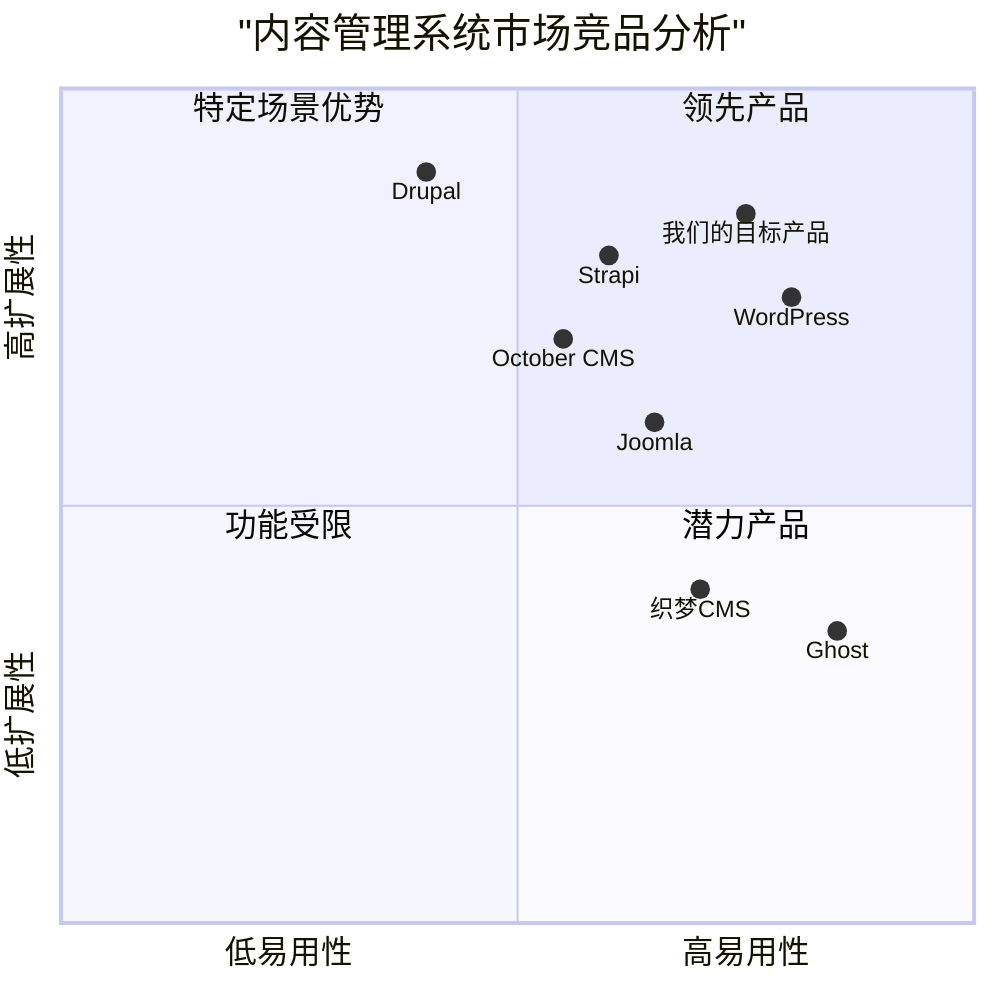

# 内容管理系统改造产品需求文档 (PRD)

## 项目概述

### 项目名称
content_management_system

### 原始需求
将一个现有应用改造成使用Vue作为前端，Java作为后端的应用。该应用是一个内容管理系统，需要包含以下模块的内容管理功能：产品中心、解决方案、咨询中心、案例展示、关于我们、联系我们。最终目标是确保用户能通过后台查看和管理所有页面内容。

### 技术栈
- 前端：Vue.js、Element UI
- 后端：Java (Spring Boot)、MyBatis
- 数据库：MySQL (可根据实际需求调整)

## 产品定义

### 产品目标

1. **功能完整性**：提供一个功能完整的内容管理系统，能够满足企业官网各类内容的管理需求
2. **技术升级**：通过技术栈升级（Vue.js前端、Java后端），提升系统的性能和用户体验
3. **易用可维护**：确保系统易于使用，同时具有良好的可维护性和可扩展性

### 用户故事

1. 作为一名内容管理员，我希望能够轻松管理产品中心的内容，以便及时更新公司的产品信息。
2. 作为一名网站管理员，我希望能够在后台管理系统中预览内容效果，以便确保内容展示符合预期。
3. 作为一名市场专员，我希望能够随时更新解决方案和案例展示内容，以便向客户展示公司的最新成果。
4. 作为一名客服人员，我希望能够查看和回复客户通过"联系我们"提交的咨询信息，以便及时响应客户需求。
5. 作为一名系统管理员，我希望能够管理不同角色的用户权限，以便保障系统数据的安全性。

### 竞争分析

| 竞品名称 | 优势 | 劣势 |
|---------|------|------|
| WordPress | 丰富的插件生态，用户群体庞大 | 安全性问题，性能瓶颈，不适合高度定制化需求 |
| Drupal | 强大的内容分类系统，良好的扩展性 | 学习曲线陡峭，速度相对较慢 |
| Joomla | 良好的用户界面，门槛较低 | 扩展性有限，自定义开发复杂 |
| Strapi | 现代化的API优先设计，前后端分离 | 社区相对较小，某些高级功能需付费 |
| 织梦CMS | 简单易用，对SEO友好 | 技术栈老旧，安全性问题，可扩展性有限 |
| Ghost | 专注于博客发布体验，界面简洁 | 功能相对单一，不适合复杂内容管理 |
| October CMS | 基于Laravel，开发者友好 | 中文支持不完善，扩展插件较少 |

### 竞品象限图



## 技术规格

### 需求分析

#### 1. 系统架构

本系统采用前后端分离架构：
- **前端**：Vue.js框架，使用Element UI组件库
- **后端**：Java Spring Boot框架，使用MyBatis作为ORM框架
- **数据库**：MySQL关系型数据库
- **通信**：RESTful API接口

#### 2. 功能模块

系统包含以下主要功能模块：

1. **用户认证与授权**
   - 用户登录/登出
   - 基于角色的权限控制（RBAC）
   - 操作日志记录

2. **内容管理基础设施**
   - 富文本编辑器
   - 媒体资源管理（图片、视频、文件）
   - 版本控制与历史记录
   - 发布工作流管理

3. **内容展示模块**
   - 产品中心
   - 解决方案
   - 咨询中心
   - 案例展示
   - 关于我们
   - 联系我们

#### 3. 数据模型

系统核心数据实体包括：

- **用户（User）**
- **角色（Role）**
- **权限（Permission）**
- **产品（Product）**
- **产品分类（ProductCategory）**
- **解决方案（Solution）**
- **咨询文章（Article）**
- **文章分类（ArticleCategory）**
- **案例（Case）**
- **案例分类（CaseCategory）**
- **页面内容（PageContent）**
- **媒体资源（Media）**
- **表单数据（FormData）**

### 需求池

#### P0（必须实现）

1. **用户认证与授权**
   - 用户登录/登出功能
   - 基本的角色权限控制
   - 安全的密码存储和验证

2. **产品中心管理**
   - 产品信息管理（新增、编辑、删除、查询）
   - 产品分类管理
   - 产品图片管理

3. **解决方案管理**
   - 解决方案内容管理（新增、编辑、删除、查询）
   - 富文本编辑功能

4. **咨询中心管理**
   - 文章管理（新增、编辑、删除、查询）
   - 文章分类管理

5. **案例展示管理**
   - 案例管理（新增、编辑、删除、查询）
   - 案例分类管理
   - 案例图片管理

6. **关于我们管理**
   - 公司简介管理
   - 团队成员管理

7. **联系我们管理**
   - 联系方式管理
   - 客户留言管理

8. **系统基础功能**
   - 前后端API通信
   - 数据库连接与基本操作
   - 文件上传与管理

#### P1（应当实现）

1. **用户体验优化**
   - 响应式布局设计
   - 表单验证与错误提示
   - 操作成功/失败反馈

2. **高级内容管理**
   - 内容预览功能
   - 定时发布设置
   - 内容版本历史

3. **媒体库管理**
   - 集中式媒体资源管理
   - 图片裁剪与优化
   - 媒体资源分类与搜索

4. **数据统计与分析**
   - 内容访问统计
   - 用户行为分析
   - 数据导出功能

5. **系统监控与日志**
   - 操作日志记录
   - 系统性能监控
   - 错误日志记录与报警

#### P2（可以实现）

1. **高级权限管理**
   - 细粒度权限控制
   - 权限组管理
   - 临时权限分配

2. **工作流管理**
   - 内容审批流程
   - 多级审核机制
   - 工作流自定义

3. **多语言支持**
   - 内容多语言版本
   - 用户界面语言切换

4. **API文档与管理**
   - Swagger集成
   - API权限控制
   - API使用统计

5. **系统备份与恢复**
   - 自动备份机制
   - 数据恢复功能
   - 灾难恢复计划

### UI设计草图

#### 1. 登录页面

```
+-----------------------------------+
|                                   |
|              LOGO                 |
|                                   |
|   +---------------------------+   |
|   |      用户名/邮箱          |   |
|   +---------------------------+   |
|                                   |
|   +---------------------------+   |
|   |         密码             |   |
|   +---------------------------+   |
|                                   |
|   +---------------------------+   |
|   |         登录             |   |
|   +---------------------------+   |
|                                   |
|   [记住我]        [忘记密码?]    |
|                                   |
+-----------------------------------+
```

#### 2. 主控制台

```
+-------------------------------------------------------------------+
| LOGO     用户名▼     消息▼      帮助▼            退出登录           |
+------+------------------------------------------------------------+
|      |                                                            |
| 侧边  |                                                            |
| 菜单  |                      控制台内容区                           |
|      |                                                            |
|产品中心|                                                            |
|解决方案|                                                            |
|咨询中心|                                                            |
|案例展示|                                                            |
|关于我们|                                                            |
|联系我们|                                                            |
|      |                                                            |
|系统设置|                                                            |
|      |                                                            |
+------+------------------------------------------------------------+
```

#### 3. 内容列表页

```
+-------------------------------------------------------------------+
| [新增]   [导入]   [导出]                        搜索框 [搜索]         |
+-------------------------------------------------------------------+
|  选择  |    标题    |    分类    |   创建时间   |   状态   |   操作   |
+-------------------------------------------------------------------+
|   □    |  XXXXX    |   XXXX    | YYYY-MM-DD  |  已发布  | 编辑 删除 |
|   □    |  XXXXX    |   XXXX    | YYYY-MM-DD  |  草稿    | 编辑 删除 |
|   □    |  XXXXX    |   XXXX    | YYYY-MM-DD  |  已发布  | 编辑 删除 |
+-------------------------------------------------------------------+
|                      分页控件: < 1 2 3 ... >                       |
+-------------------------------------------------------------------+
```

#### 4. 内容编辑页

```
+-------------------------------------------------------------------+
| [返回]                                        [保存草稿]  [发布]    |
+-------------------------------------------------------------------+
|                                                                    |
| 标题:  +------------------------------------------------+          |
|        |                                                |          |
|        +------------------------------------------------+          |
|                                                                    |
| 分类:  [下拉选择框▼]                                               |
|                                                                    |
| 封面图: [选择文件]  [预览图]                                         |
|                                                                    |
| 内容:                                                              |
| +--------------------------------------------------------------+ |
| |                                                                | |
| |                   富文本编辑器区域                              | |
| |                                                                | |
| +--------------------------------------------------------------+ |
|                                                                    |
| SEO设置:                                                           |
| 关键词: +------------------------------------------------+          |
|        |                                                |          |
|        +------------------------------------------------+          |
|                                                                    |
| 描述:   +------------------------------------------------+          |
|        |                                                |          |
|        +------------------------------------------------+          |
|                                                                    |
+-------------------------------------------------------------------+
```

## 开放性问题

1. **数据迁移策略**：如何从当前系统无缝迁移数据到新系统？是否需要数据转换工具？

2. **部署方案**：系统将如何部署？是否考虑容器化（如Docker）？如何确保部署过程的可重复性？

3. **性能需求**：系统需要支持多少并发用户？有哪些性能指标要求？

4. **安全需求**：除了基本的认证和授权，是否需要其他安全机制，如防SQL注入、XSS防护等？

5. **系统集成**：新系统是否需要与其他系统集成？如ERP、CRM等？

6. **SEO考虑**：如何确保前端Vue.js应用对搜索引擎友好？是否需要使用服务器端渲染（SSR）？

7. **浏览器兼容性**：系统需要支持哪些浏览器及其版本？

8. **数据备份与恢复**：数据备份策略是什么？如何进行灾难恢复？

## 实施计划

### 阶段一：基础架构搭建（估计耗时：3周）

1. 前端Vue.js项目初始化
   - 安装必要的依赖和插件
   - 设置项目结构和路由配置
   - 配置开发环境

2. 后端Java Spring Boot项目初始化
   - 创建项目基础结构
   - 集成MyBatis
   - 设置数据库连接
   - 配置基本安全机制

3. 数据库设计与初始化
   - 根据数据模型设计数据库表结构
   - 创建初始数据

### 阶段二：核心功能开发（估计耗时：6周）

1. 用户认证与授权功能
   - 登录/登出功能实现
   - 角色和权限控制实现

2. 基础内容管理功能
   - 产品中心管理功能
   - 解决方案管理功能
   - 咨询中心管理功能
   - 案例展示管理功能
   - 关于我们管理功能
   - 联系我们管理功能

3. 系统基础功能
   - 文件上传与管理
   - 通用组件开发

### 阶段三：高级功能开发与优化（估计耗时：4周）

1. 高级内容管理功能
   - 内容预览功能
   - 定时发布设置
   - 内容版本历史

2. 用户体验优化
   - 响应式设计调整
   - 表单验证与错误提示优化
   - 操作反馈机制完善

3. 系统监控与日志功能

### 阶段四：测试与上线（估计耗时：3周）

1. 系统测试
   - 功能测试
   - 性能测试
   - 安全测试

2. 数据迁移
   - 开发数据迁移工具
   - 执行数据迁移
   - 验证数据完整性

3. 系统上线
   - 部署生产环境
   - 系统监控配置
   - 用户培训

## 总结

本产品需求文档详细说明了将现有内容管理系统改造为基于Vue.js前端和Java后端的新系统的需求和实施计划。新系统将提供全面的内容管理功能，包括产品中心、解决方案、咨询中心、案例展示、关于我们和联系我们等模块。使用MyBatis作为持久层框架，可以提供更灵活的SQL控制和更好的性能优化能力。该系统将采用前后端分离架构，通过RESTful API进行通信，满足现代企业网站内容管理的需求。
